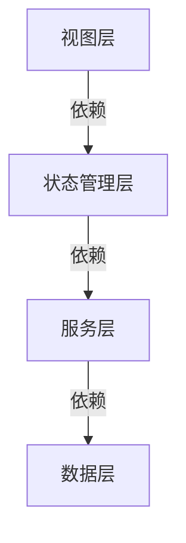

# Flutter课程表应用框架文档

## 项目结构

```
lib/
├── components/        # 可复用组件
│   ├── bottom_nav_bar.dart
│   ├── course_edit_dialog.dart
│   └── timetable_management_dialog.dart
├── constants/        # 常量定义
│   ├── app_constants.dart
├── data/            # 数据模型
│   ├── course.dart
│   ├── settings.dart
│   └── timetable.dart
├── services/        # 业务服务
│   └── course_service.dart
├── states/          # 状态管理
│   └── schedule_state.dart
├── utils/           # 工具类
│   └── color_utils.dart
└── views/           # 视图页面
    ├── day_view.dart
    ├── list_view.dart
    ├── settings_view.dart
    └── week_view.dart
```

## 核心架构

### 1. 数据层
- `Course`: 课程数据模型
- `Timetable`: 课表数据模型
- `AppSettings`: 应用配置管理

### 2. 服务层
- `CourseService`: 课程数据查询和持久化

### 3. 状态管理层
- `ScheduleState`: 管理应用核心状态(ChangeNotifier)
  - 当前周数
  - 视图类型
  - 课表列表
  - 课程管理方法

### 4. 视图层
- `WeekView`: 周视图
- `DayView`: 日视图
- `ListView`: 列表视图
- `SettingsView`: 设置页

## 关键设计模式

1. **状态管理**: Provider模式
2. **数据持久化**: SharedPreferences
3. **不可变对象**: 数据模型使用copyWith模式
4. **响应式布局**: 适配不同屏幕尺寸

## 代码规范

1. 文件组织按功能模块划分
2. 使用Dart文档注释
3. 遵循Effective Dart指南
4. 组件拆分合理(容器组件/展示组件)

## 依赖关系



## 典型数据流

```mermaid
sequenceDiagram
    视图层->>状态管理层: 触发动作(如切换周数)
    状态管理层->>服务层: 请求数据操作
    服务层->>数据层: 读写数据
    数据层-->>服务层: 返回数据
    服务层-->>状态管理层: 返回结果
    状态管理层->>视图层: 通知更新

## 课程编辑状态管理

1. **组件内部状态**:
   - 使用StatefulWidget管理编辑表单状态
   - 通过TextEditingController管理输入字段
   - 临时保存编辑结果在_editingCourse变量中

2. **与全局状态交互**:
   - 通过onSave回调将编辑结果传递给ScheduleState
   - ScheduleState处理数据验证和持久化

3. **数据流**:
```mermaid
sequenceDiagram
    视图层->>编辑对话框: 打开编辑界面(传入课程数据)
    编辑对话框->>编辑对话框: 管理本地编辑状态
    编辑对话框->>状态管理层: 提交编辑结果(onSave)
    状态管理层->>服务层: 验证并保存数据
    服务层->>数据层: 持久化存储
    状态管理层->>视图层: 通知数据更新
